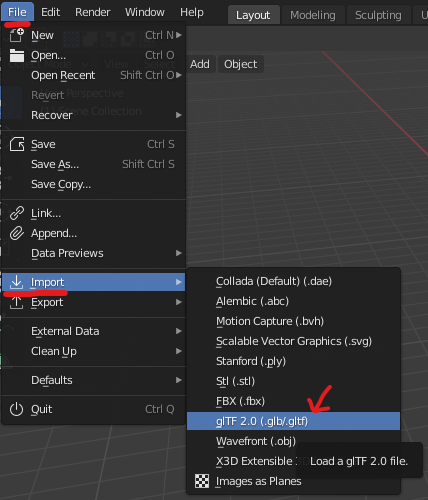
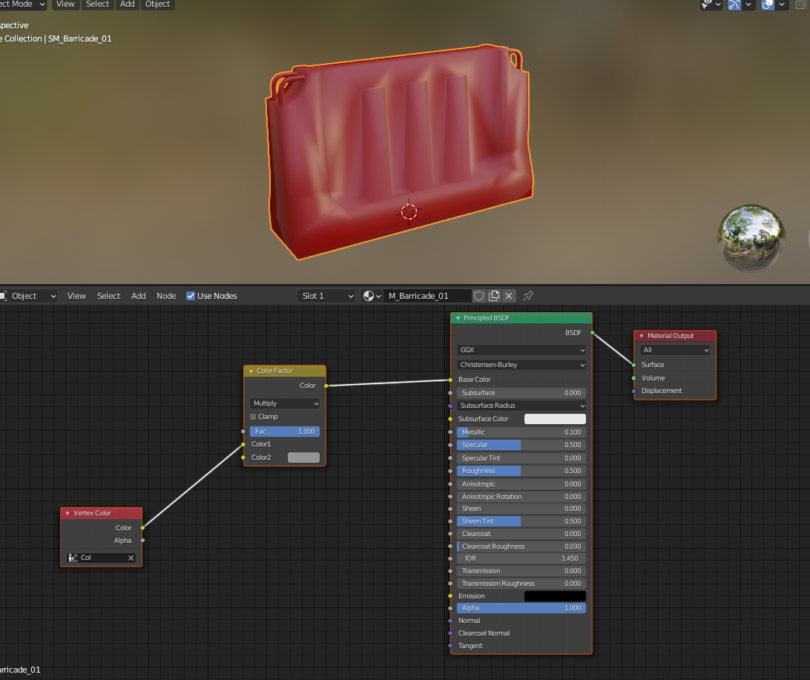
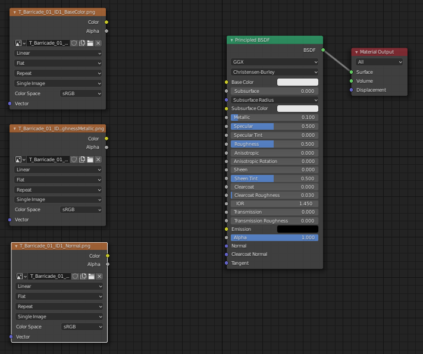
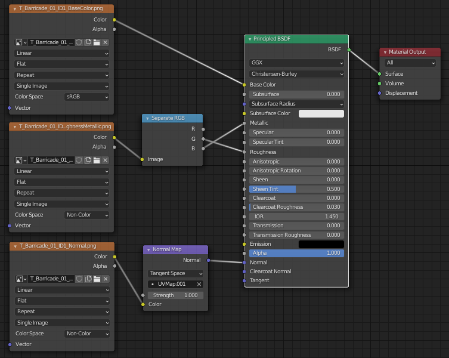
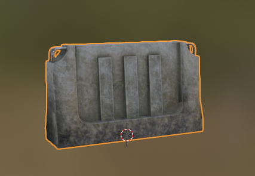
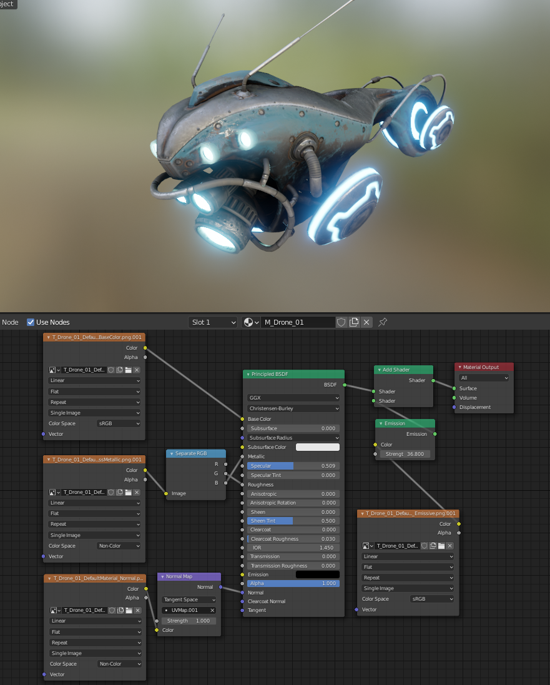

# Importing glTF2
In this quick guide, we will be importing game files into Blender and applying their materials.

I'm assuming you already exported GR game files, if not.. check [Exporting Game files](ExportGamefiles.md).

_Note: if you're an experienced Blender user, you can skip the majority of this guide. If you're a complete beginner, try to follow along, I would also suggest watching a few Blender tutorials on YouTube._

 
Select the gltf file you want to import from the exported umodel files.

# Applying Materials (Color, Normal, ORM)
This part is well documented on Blender's website:
[glTF 2.0](https://docs.blender.org/manual/en/2.80/addons/io_scene_gltf2.html), but I will give a brief explanation and common patterns for GR.

Once you have the model in Blender, switch to `Shading` tab, should look like this:

- Remove default nodes **besides** `Principled BSDF` and `Material Output`.
- Drag and drop all the corresponding textures of the model. 
The textures are usually located in a subfolder `Textures` or `Tex` within the same folder as the model, sometimes even in the same folder as the model. 
Usually 3 textures; Color, Normal, and ORM.  
Some will have more layers like emission color and divided textures.

This should look like this:

Connect the nodes as shown:

End results:

# Applying Materials with Emission Layer

Very similar to the previous layout but with an additional "texture" tagged as Emission in its name. Connect the nodes as shown:

# Exporting to FBX (and to UE4)
If you're asking why would we want to export it back to UE4 - if we want to mod/swap existing models with new/custom models or just add an in-game reference into UE4 to be overridden.

How to Export:
- Select the object you want to export.
- File > Export > FBX.
- Check `Selected Objects`. (if you have multiple objects in a scene)

In UE4, drag and drop the newly created FBX file on top of the Content Browser and it should import everything. 
If the model has a complex material, it won't be loaded properly and you'll have to reapply it in UE4 again.
