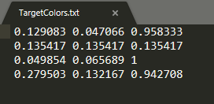
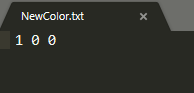
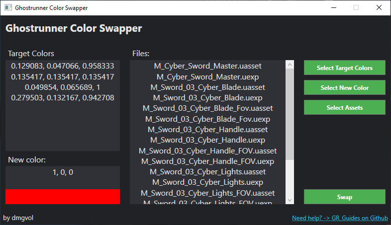
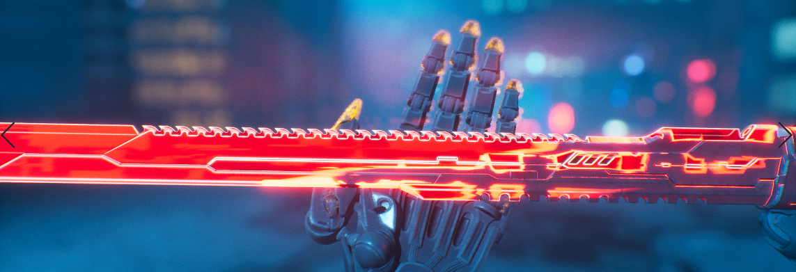

# Changing Colors with ColorSwapper
In order to shorten the process of changing all individual hex RGB values, I've created a tool that replaces all of them.

You can download the tool here: [GRColorSwapper](./Tools/GRColorSwapper.zip).

As a quick demonstration of the tool, I will change the void-sword color.

Color RGB Presets -> [Color Presets](#color-presets)

Small disclaimer: if it doesn't work for you, use the [hex method](HexColors.md).

## Input Files
2 simple text files:
- TargetColors; each RGB value is spaced out and separated by a new .</br>
</br>
- NewColor; will contain a single RGB set - that's the color you want to change to.</br>
</br>
  
## Swap!
Just like in the hex guide, we will need raw export/assets.

Open the tool and follow these steps:
- `Select Target Colors` - select text file with RGB values.
- `Select New Color` - select text file with your new RGB value.
- `Select Assets` - select all .uasset and .uexp files.
- Swap! 
- Pack all files and you're done!



## Results



---
# Color Presets (TargetColors)
## Swords
Void-Sword
```
0.129083 0.047066 0.958333
0.135417 0.135417 0.135417
0.049854 0.065689 1
0.279503 0.132167 0.942708
```


DLC-White
```
1 0.023868 0
1 0.023868 0
0.84375 0.84375 0.84375
```

DLC-Silver
```
1 0.029851 0.021
0.84375 0.84375 0.84375
```

DLC-Default
```
1 0 0,
0.84375 0.450948 0
```

DLC-Black
```
1 0 0
0.84375 0 0
```

Killrun-sword
```
1 0.896269 0
0.672443 0.23074 0
0.96875 0.543936 0.067017
1 0.316667 0
1 0.766463 0.093989
```

Pre-order-PC(Steam)
```
0.536458 0.25434 0.021624
```
Pre-order-Purple(GOG)
```
0.332977 0.027154 0.473958
0.590505 0.822917 0.061354
```

## Gloves
Killrun
```
0.672443 0.23074 0
```

China_04 - glowing red gloves
```
1 0 0
```

