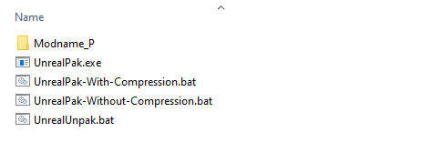
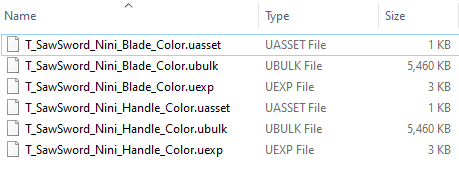
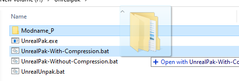

# Creating .Pak Files

## UnrealPak Folder
Create a folder that will contain the scripts, raw mod folders and output pak files, similar to this:



_If you have no idea what are these files are, download them from [Tools/UnrealPak](./Tools/UnrealPak.zip)_


## Mod Folder
Each time you will have a new mod, create a new folder and name it as follows:</br>
"**Modname_P**" - The `_P` is **super important!**</br>
Example: `Coolsword_P` or `YellowGloves_P`

Each folder has to have the same structure:
```css
\modname_P\Ghostrunner\Content\...
```

Depending on the mod and which files it overrides, it will have the same folder hierarchy followed by the original GR folder hierarchy (visible in UMODEL and exported folder structures).

And once you have the modified files, place them in their corresponding folders like textures, models and other uassets inside the mod folder.

**For example:** if we are about to mod a katana texture, most likely it will be: </br>
```css
\modname_P\Ghostrunner\Content\Visual\Characters\Hero_Swords\Mat\Tex\
```

And its content will be like this: (the last Tex folder):




---
## Using the script
Simple, just drag the mod folder onto the `UnrealPak-With-Compression.bat` and after couple of seconds it will create the pak file with the same name as the folder.


## Adding PAK files to GR
Don't think I should explain this as you already should know this;</br>
Place it in this folder and launch the game!
```css
...\Ghostrunner\Ghostrunner\Content\Paks
```
