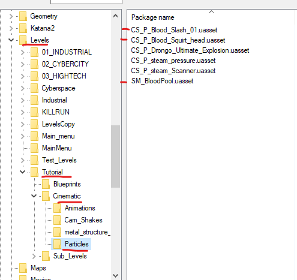
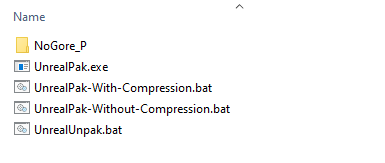
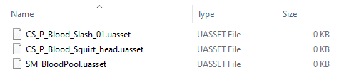

# Disabling/Removing textures or objects
It's a cool trick I learned, if you want to remove objects/textures you can literally erase uasset content(empty file), and pack an empty uasset file back into pak. 
This trick works on models, VFX, particles, sounds, textures.

**In this example**, we will remove the blood/gore effects in the first cutscene of Awakening which can not be turned off even through settings.

## Locating Game files
Using UModel, we can look for which objects we want to disable and in this case, it looks logical that these files correspond for what we're looking for:



## Creating Mod Folder
For convenience, mod folders will be created in the same folder as the UnrealPak.

Create a new mod folder and name it as you like, I named it `NoGore_P`. (For this example)



The next step is to match the folder hierarchy, meaning you have to create the same folders you see in umodel inside the mod folder, in this case:
```css
NoGore_P\Ghostrunner\Content\Levels\Tutorial\Cinematic\Particles
```

## Empty UAssets
Create new text files and name them **EXACTLY** as they are in umodel, like this:



And we're done! now all you have to do it pack it and check it in-game!

You might notice that the sound is still there - that I will leave to you to find the files and disable them as well (yeah, homework!)