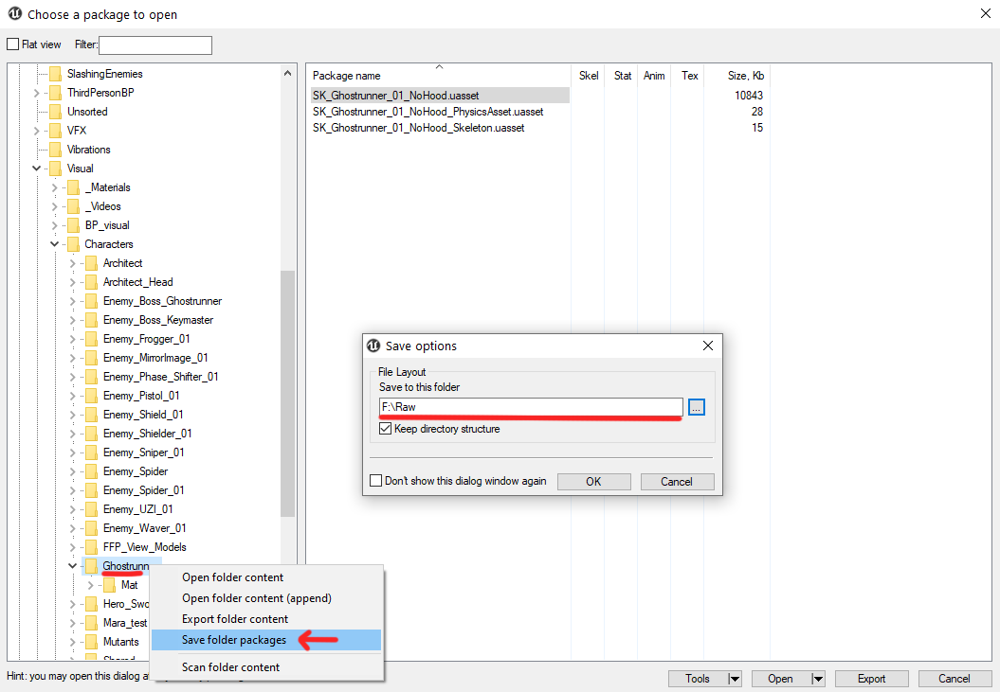

# Exporting Game files

There are multiple ways of exporting/ripping game files like UnrealPak, QuickBMS, UModel and many others but since I'm used to UModel, I'll will be showing you how to export using UModel.

## Starting UModel
Launch UModel(UE Viewer)

- Browse and locate the Paks folder within the Ghostrunner folder.
- Select the correct UE version which GR uses: `4.25`.
- If you want to export Sounds as well: mark the `Sound` checkbox.

And Click OK.  
_Note: Your UMODEL window might look different on the latest version._

---
## Exploring Files
Feel free to explore game files, browsing models and textures. 
You can also preview animations as well.

## Types of Export
There are two main exporting types which I call `Raw` and `Export`.
- Raw: raw game files like UAssets, UMaps, UExp, and UBulk.
- Export: readable files like PNG/TGA(textures), Gltf2(models), and reference files.

You'll have to export specific/all game files depending on their modding scale and requirements.  
In further guides, I will state which type of export we will be using for each one, so you'll probably come back when you will need it.

---
## Exporting
### Type: `Export` 
- Right click on the folder(s) and click `Export folder content`.
- Specific items: select items and click `Export` at the bottom.
- Specify the path, make sure you select glTF 2.0 and PNG or TGA as shown below.

### Type: `Raw`
 - Similar to previous exporting type, right click and click select `Save folder /packages`.
 - Specific items: select items, right click and select `Save Packages`.
  

