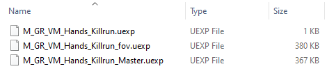
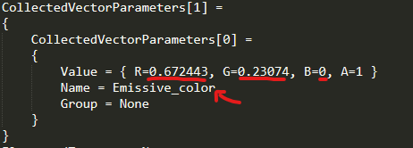
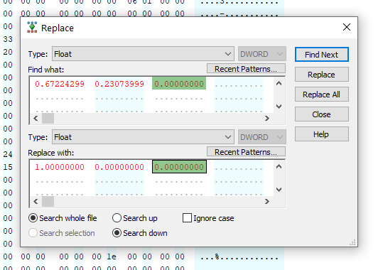
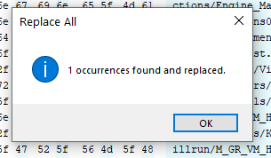
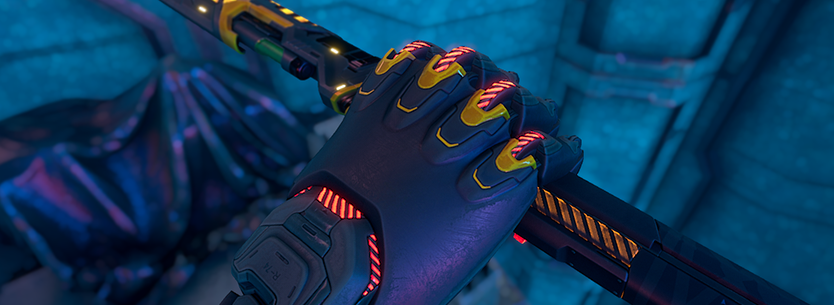

# Changing Colors using Hex

In this guide, we will change colors through hex, emission/animated colors like in gloves and swords.</br>
For this example we will change Killrun Gloves color to red, the moving/animated lines.

[Export Type: `BOTH`]</br>
Export in both types!


## Mod Pack
We will start with the mod pack first, for convenience.</br>
After finding the right uassets using UModel or through already exported files, create the corresponding mod folder, for this example that would be:
```css
<modname>_P\Ghostrunner\Content\Visual\Characters\FFP_View_Models\GhostRunner_VM_Hands\Mat\Skins\Killrun
```

[Export type: `Raw`]</br>
And place all `.uexp` files into the last folder, like this:



We will come back to it later, so leave this open.


## Getting Default values
Navigate to the same path but in Export Type: `Export`, similar files will be present but notice the additional/new files named `<name>.props.txt`.</br>
Those files are "reference" files showing which textures it uses and which values/parameters that specific Material is using.

For this example, the color RGB values are located in `M_GR_VM_Hands_Killrun_Master.props.txt` but usually you should go through every file and look for the right RGB values.

- Open the `.props.txt` file and scroll down until you find some RGB values.
- We're looking for these values in particular:



`0.672443 0.23074 0` <- Write this down in a notepad</br>
And also write down your new rgb value (don't know how? check [FAQ](#faq) )


## Replacing Values using Hex
Navigate back to the mod pack which we created previously,</br>
and open each `.exp` file with a hex editor (I use `Hex Editor Neo`).

For each file, find the default rgb values and **replace all** with your new color values as shown below (not all files will contain the RGB values):



If something was found - it will show a similar message:



Make sure you save all modified files!


## Packing
Once you're doing replacing hex values, you can remove all files that were not changed in the previous step, so for this example only 2 files need to stay: `M_GR_VM_Hands_Killrun_fov.uexp` and `M_GR_VM_Hands_Killrun_Master.uexp`.

And we're done! pack as usual and check in-game results!


## Results




## FAQ
Q: How to convert RGB values?</br>
A: Divide each RGB value by 255, for example: rgb(51, 187, 255) -> (0.2, 0.733, 1)


Q: I'm getting multiple RGB values, which one to replace?</br>
A: Replacing all won't hurt, but you can double-check each one and see if it matches with what you're looking for.

Q: I noticed there are other paramters besides RGB values, can I change them as well?</br>
A: Yeah you can, same principles but those changes are less noticable in-game.


