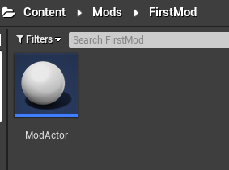
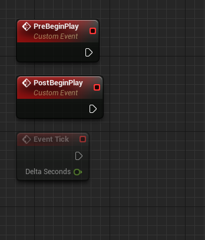
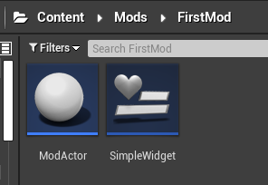
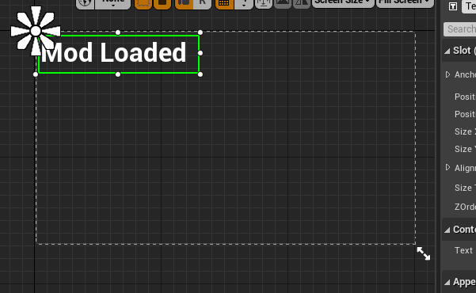
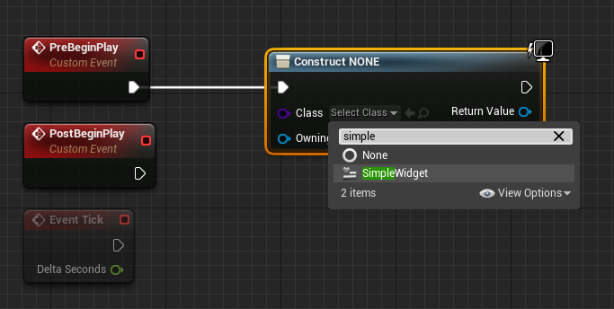
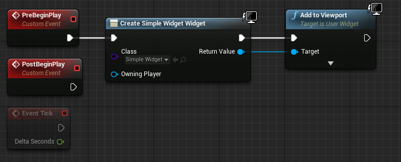
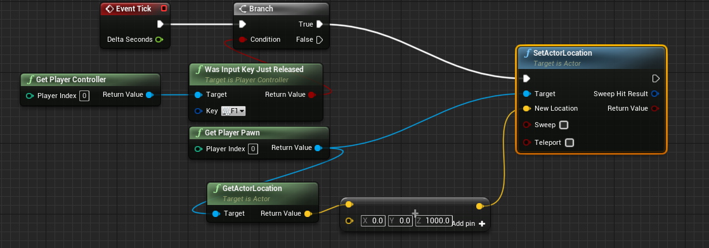
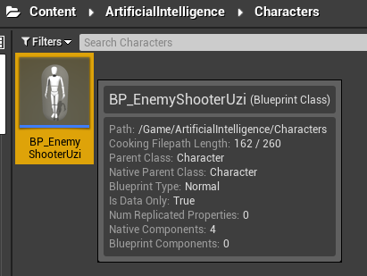
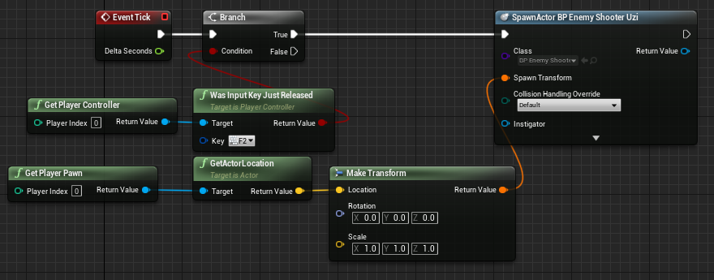

# GR Mod Loader

Mod Loader Download: [UnrealModLoader](https://github.com/RussellJerome/UnrealModLoader/releases) by RussellJerome.

Since this is new and the first question people ask: "What's a mod loader?"  
I would like to answer it before we begin: 
Traditionally we had to pack uassets so it will override original game files, but using the mod loader, allows us to use custom blueprints that are injected at runtime, giving us much more control without overriding game files.

**Note:** UE4 experience is required, the more the better. (if you want to create serious, advanced, cool mods)

Guide Table of Content: 
- GR Mod Loader
  - [UE4 Project Setup](#ue4-project-setup)
  - [Simple Mod Example (UIWidget)](#simple-mod-example-uiwidget)
  - [Packing the Mod](#build-and-pack-it)
  - [Using the ModLoader](#using-the-modloader)
  - [Simple Mod Examples](#simple-mod-examples)

 

## Mod Loader
Running it the first time will create an additional folder in Pak folder named `LogicMods`. 
This is where you place the packed mods into. 

## UE4 Project Setup
- Create a folder hierarchy `Mods/<ModName>`
- Create a Blueprint-Actor and named it `ModActor`.

- Open the Blueprint's EventGraph.
- Create two custom functions. (right click and look for "add custom event")
- Name them `PostBeginPlay` and `PreBeginPlay`.

## Simple Mod Example (UIWidget)

For this example I will display a simple UI Widget, to do so:
- Create a WidgetBlueprint (Right click, User interface > Widget Blueprint).
- Name it as you wish, I named it `SimpleWidget`.

Open it, place a simple text, change text, save, and close it

Go back to ModActor, add `Create Widget` node and pick the widget we've created.

Add `Add to Viewport` node and connect as shown

## Build and Pack it!
Packing is similar yet different, mod folder: 
`FirstMod/Ghostrunner/Content/Mods/FirstMod`  
(I called the mod `FirstMod`, and yes without `_P`)

Place the PAK file inside the `LogicMods` folder inside the usual `Paks` folder.

## Using the ModLoader
Note: **Close any running Unreal Editors or any other UE4 apps**

- Run `UnrealEngineModLauncher.exe` as Administrator.
- Should say "Waitng for Game Window..."
- Launch the game, you will see a lot of info showing up.
- Look for `Successfully Loaded <Modname>` - if everything is loaded properly.

---
## Simple Mod Examples

### Player TP
Will teleport the player 1000 units upwards when pressed F1

### Spawn Enemies (or any other BP)
Spawning Blueprints - Enemies (can spawn **any** BP)
Create an empty Blueprint-Character and name it `BP_EnemyShooterUzi` in `Content/ArtificialIntelligence/Characters/`

By doing this, we're creating a fake game reference, only the name and its folder is important, the game will do the rest. 
You can create much more fake blueprints/references by looking at the exported raw files or through UModel. (including models)

ModActor: EventGraph

### What's next?
Feel free to explore and create awesome mods.

If you're not experienced enough with UnrealEngine, I will suggest learning it so you will be able to create your own additional blueprints, behaviors, events, actors and link them all together. 
If you are an expert in unreal - well... I expect amazing mods from you!
