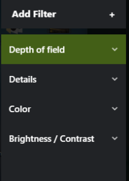

# Advanced Photomode
I get asked a lot on how I manage to create such stunning photomode images, so to answer it I've created this quick guide.

## Before starting
You will need a few extra tools:
- Universal Unreal Unlocker ([Click to download](https://framedsc.github.io/GeneralGuides/universal_ue4_consoleunlocker.htm)).
- Nvidia Experience with InGame Overlay and GameFilters enabled.
- ExtendedPhotoMode mod - unlimited range (in GRSR, #mod-releases)

## Photomode
Start with finding your spot and angle for the shot and enter the in-game photomode.

I usually apply the same settings:
(Bloom, Grain, Fringe and Filter are up to your personal style)

## Nvidia Game-Filters
Click Alt+F3 to enter Nvidia's Game-Filter or Alt+Z and select GameFilter. (Don't press Alt+F4 by mistake...)

I personally like to add/use these filters, Depth-of-field is the most important one: 

Feel free to play around with the settings until you find what suits your style.

Already looking **MUCH BETTER**! but you might ask how do we capture all filters/effects without UI? - here comes the part where we need UUU. 
Since we're using overlapping filters, capturing the image with in-game "Take screenshot" is useless.

## Unreal Unlocker
Unreal Unlocker is a powerful tool but for this we will use only a single hotkey to disable in-game UI.

- Launch UUU.
- Select GR process.
- Inject DLL.

You'll see some popups ontop of GR - that's great! 
We're almost done!

To remove UI just press the **DELETE** key.
Take a screenshot! I'm using Nvidia screenshot which is F11 for me (check your Nvidia overlay keybindings).

## Results

