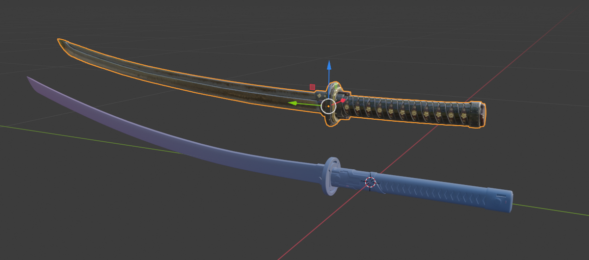
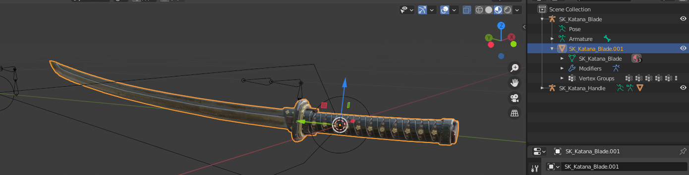
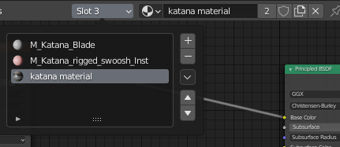
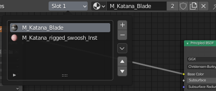
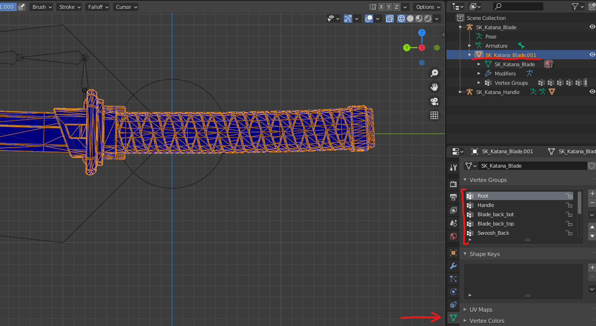
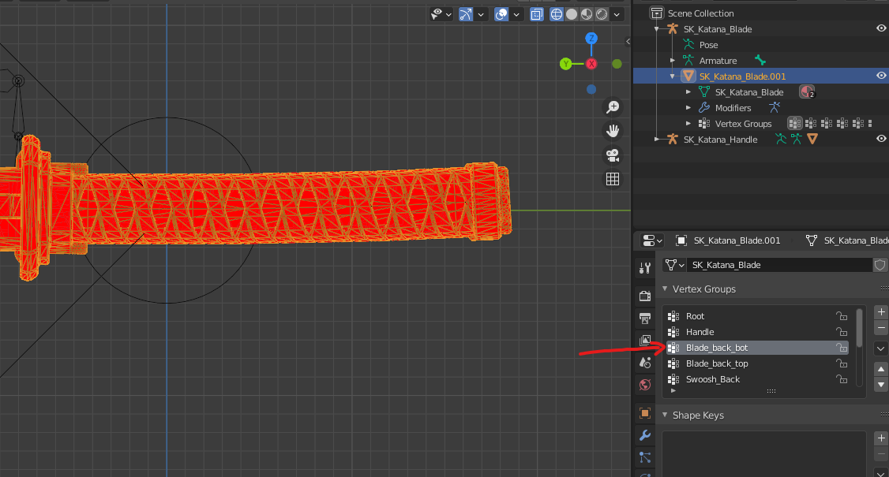
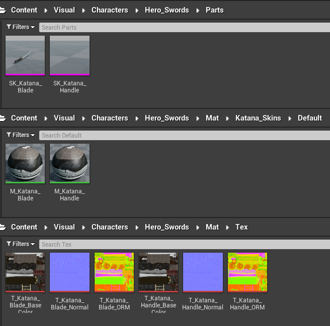
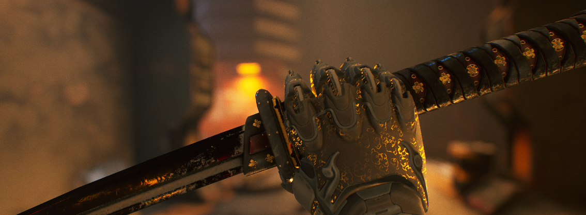

# Replacing Swords
[Export Type: [Export](./ExportGamefiles.md)]

I'll be using Blender but you can use any other 3D software of your choice. 
Note: 3D experience is recommended but not mandatory.

For this example, I will replace the default sword with a custom sword, and if you're replacing a different sword - your naming and UE4 arrangement will be slightly different so pay attention.

Katana Model Used: [Link](https://sketchfab.com/3d-models/katana-display-985909d7491a41088c081a24377f6037) 
(How to make ORM layer can be found in [FAQ](#faq) below)

### Disclaimer:
This method of modding the sword is not the "traditional" method and won't make the sword "bend" as intended in-game, like the rest of the swords and won't have the "swoosh" arc/line effect. 
However, this will still bring your custom sword in-game and properly working with in-game animations and cutscenes. 
Without further ado, let's begin!

## Blender
Import both parts of the sword(game-files), and the new sword which you want to replace it with.

Swords in GR are separated into 2 sections; Blade and Handle. 
There are 2 approaches for this:
- Split your model into 2 parts (Handle and Blade), merge/replace corresponding meshes and continue from there. (including 2 textures)
- Have the whole model in one section while the second section will be empty.
  For example: placing the whole sword in Blade, and having the handle to be empty.

I will be showing the 2'nd method as it's faster, easier and the one which works for me.

## Merging Meshes 
- Place the new sword on top of the original sword the way it looks good. (scale, orientation)
- Select the original sword blade, go to Edit mode and make sure everything is **selected**.
- Select the new model, Edit mode, and **unselect** everything.
- Select the new model mesh and **then** the original blade mesh.
- Ctrl+J (to merge meshes).
- The new sword should merge **into** the original mesh while the object hierarchy stays as the original.
- Go to Edit mode and press DELETE - this will remove the old mesh and leave the new.
- Since we don't need the original handle, select the handle mesh, Edit mode, and remove all.

## Fixing Texture Layers
Texture layers were also merged, but the number and the order of the textures are important, so go to **Shading tab** and rearrange them (naming is optional)

From this: 
 
To This: 

- Move actual texture above the Blade.
- Remove the `M_Katana_Blade`.
- Name the texture back to `M_Katana_Blade`.

## Applying Weights
Swords have animation bones and weights which we need to re-apply for our new mesh.

Select the mesh and switch to **Weight Paint**, and click on Object Data Properties tab to see the Vertex Groups.

Cycle through **ALL** of the Vertex Groups and make sure all have 0 weight (colored blue), **besides** the vertex group called `Blade_back_bot` - color it with 100% weight (solid red)! 

_Tip: you can Alt-LeftClick to Gradient paint it, so you can do it above the mesh to cover it completely with a single color._

## Exporting
Select all Blade related objects and export to FBX (check Limit to selected objects box), and name it `SK_Katana_Blade.fbx`, same with the handle, but name it `SK_Katana_Handle.fbx`.

## UE4 Project
Create the corresponding folder structure: `Content/Visual/Characters/Hero_Swords/Parts`.

### Importing
- Drag and drop both FBX files.
- Remove both auto-generated skeletons.

### Naming and Arranging Files
Just like the rest, we need to name all imported files to match original game-file names as seen in UModel.

- Both Material objects move to `Hero_Swords/Mat/Katana_Skins/Default` and name them accordingly: `M_Katana_Blade` and `M_Katana_Handle`.
- In case of missing textures: import them manually.
- Since Handle and Blade textures are in 2 different textures, duplicate them if you have the same texture for both, name them accordingly, and move them to `Mat/Tex`.
- ORM textures: Double click on the texture, and make sure you set the compression settings to **Masks(no sRGB)**.

## Packing
Build UE4 project, create mod folder and move/copy all files into mod folder. 
**Before you pack:** remove the skeleton and both materials, leaving only the meshes and textures.

### Notes:
- Your future mods will be much faster since you'll need to work and export only the blade.

# Results

---

## FAQ
Q: What's ORM? 
A: ORM stands for Occlusion, Roughness and Metallic which can be merge/combined using Photoshop.

Q: How do I convert Occlusion, Roughness, Metallic layers into ORM? 
A: If you have these 3 layers you can make ORM layer, here's a quick video:[Packing Textures Into ORM In Photoshop](https://www.youtube.com/watch?v=0lNYRO6LR0g).

Q: How can I add Emission Layer/Texture? 
A: You must replace a sword with pre-existing glow/emission layer.

Q: How can I make sword "bend" as intended? 
A: Look at the original Weight paints and try to mimic it onto the new model.

Q: How can I add "Swoosh"? 
A: The "swoosh" mesh is a tiny narrow mesh inside the original Blade, create a similar one and apply the corresponding weights to it.

Q: What would be the "traditional" way? 
A: Similar to this whole guide but splitting the mesh into two parts and working with each separately, applying proper weights, and not deleting the "swoosh" mesh (look at the original katana parts as reference), in UE4 both model parts have to use the same skeleton and placed in Hero_Swords folder.

