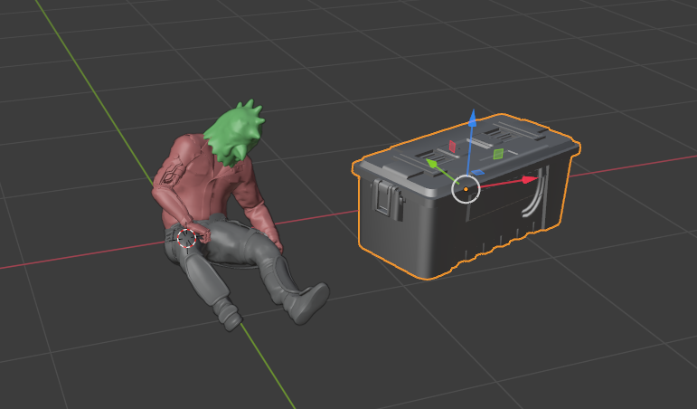
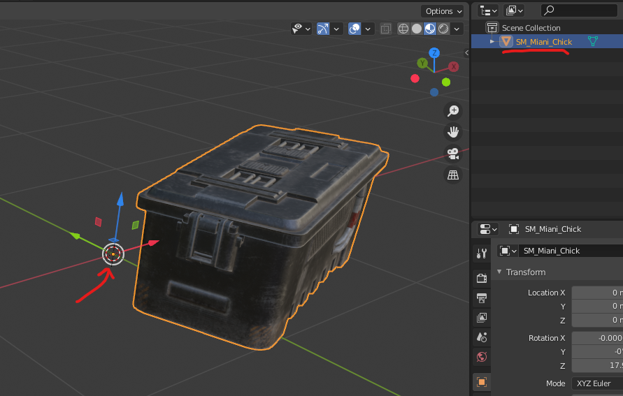
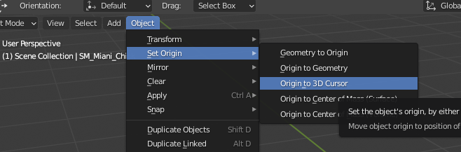
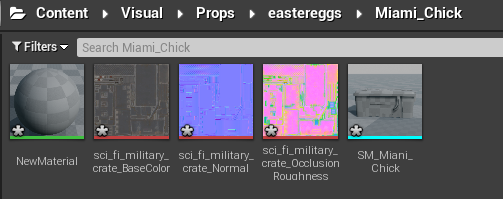
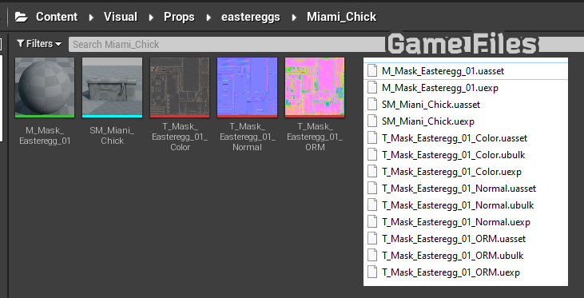
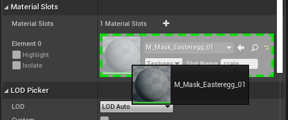
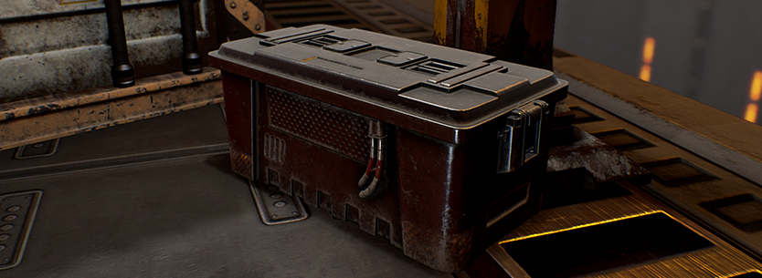

# Replacing Basic Models
In this guide we will replace/swap a basic model with our own model, including textures. 

For this example I will be replacing the `Miami_Chick` easteregg model with a "cyberpunk" crate.  The crate model that I'm using is aimed towards UE4 meaning the texture layers are: Color, Normal and ORM.
Link to the model: [sci-fi-military-crate](https://www.cgtrader.com/free-3d-models/military/other/sci-fi-military-crate-2be70da1-2925-4ee0-9500-a9686edb3a94).

 _(Yes there's a typo in this particular game-file...)_

## Blender
[Export Type: `Export`] 
If you don't know how to load game files into Blender, check: [Loading game files into Blender](BlenderGltf2.md).

- First thing will be to load both models (original & custom), just to get the sense of scale and orientation of the model. (and apply materials)

- Place your new model as you wish, remove original model and name your model with the same name as the original model.

- To make sure we have the same offset from the position origin, we need to set the model origin to 3D cursor(or the center of the axis in case you moved your 3D cursor):

- Export model to FBX with the same name as the model and launch UE4 project.

--- 
# UE4 Project
- Create the corresponding folders, for this example that would be: 
`Visual\Props\easteregss\Miami_Chick`
- Import the model(FBX) and the textures by dragging them into UE4 window.
- If case it generated a new material - remove it and create a new one.

Should look like this:

- Place textures and materials in their subfolders (if any), this model has its textures and material object in the same folder.
- Name all objects to match game files.

_(Game files using UModel or through Export-Type:Raw)_

## Object Linking
Now we need to link everything so UE4 and GR will know which material, texture and model to use.

### Model
 - Apply the Material to the model (double click on the model).
 - And drag the Material object onto the Material slot, like that:
 - Click Save(top left) when you're done and close the Model window.

## Build and pack!
 - Don't forget to save all changes, build UE4 project.
 - **Important**: before you pack, remove the Material files, both `.uasset` and `.uexp` (from the mod folder). In this example, that would be `M_Mask_Easteregg_01.uasset` and `M_Mask_Easteregg_01.uexp`.

# Results

---
## FAQ
Q: Why we removed the material before packing? 
A: We just need to reference the material that the model uses and not its contest, the game will handle the rest.

Q: How GR knows what material to use if we applied an empty material in UE4 and then removed it completely? 
A: Textures and UV maps are stored on the model/FBX itself, the material just links them together, so we don't care about its content - we let GR use its default Material.

Q: How can I override a game model if my model is separated into multiple meshes  
A: Select both meshes and click Ctrl+J  (in Blender).

Q: What's ORM layer? 
A: ORM is generated when using Substance Painter and exporting to UE4, it's 3 layers combined into one.

Q: What do I do if my textures have no ORM layer? 
A: A quick fix will be to create an empty image with the same dimensions and paint it bright pink (look at other ORM texture as reference).
