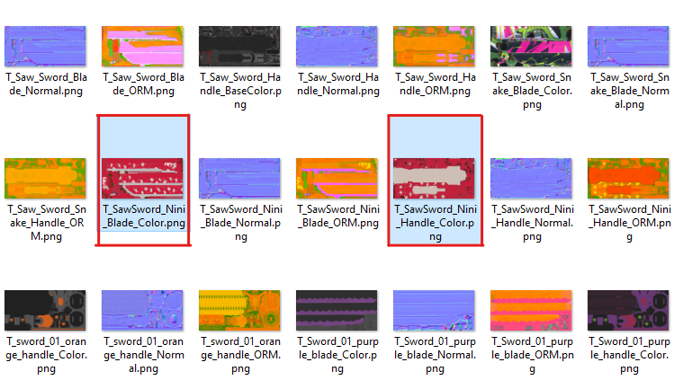
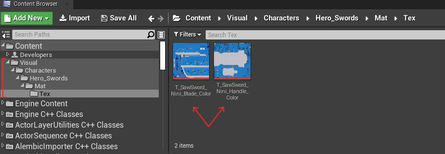
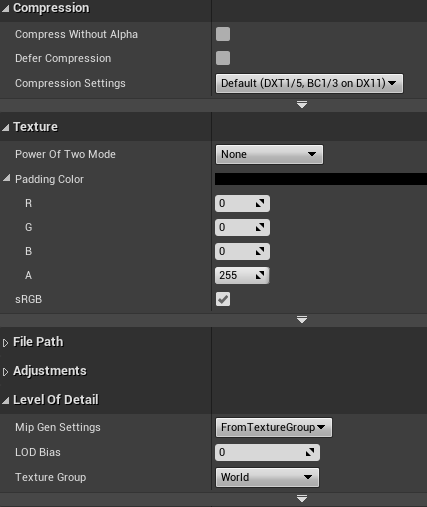
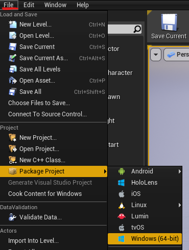
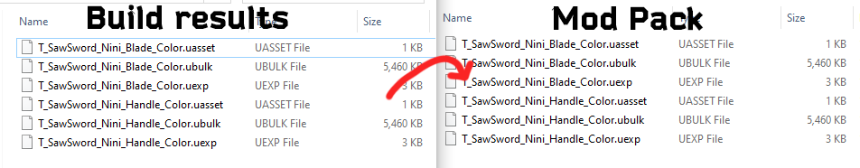
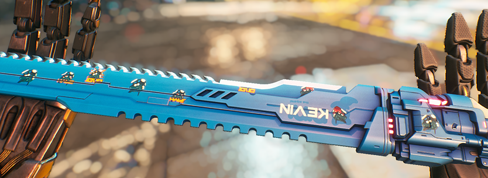

# Replacing Textures
In this tutorial we will replace a katana texture but this technique applies to any in-game texture; props, VFX, UI, Ads, Posters, Graffiti, Enemies and etc.

## Export Textures
[Export type: `Export`]

Using Umodel, find the right texture/material and export it as PNG or TGA format.</br>
And if you have exported all the game files already, just locate the textures as I did:
`Game\Visual\Characters\Hero_Swords\Mat\Tex`



_note: If you don't know how to export, read [Exporting Game files](./ExportGamefiles.md)._

## Editing Textures
Use any editing software of your choice and make sure to save with the same name as the original file name.</br>
If you're using TGA format, make sure to save it in 32 bits/pixel resolution.

---
## Importing to UE4 Project
Launch UE4, create the same folder structure as it was in umodel and import our modified textures by dragging them into the project window



Make sure you create the corresponding folder structure, like this:
`Visual\Characters\Hero_Swords\Mat\Tex`

Double-check all imported textures have the right/same settings, in this instance: </br>
(Note: For Normal map select NormalMap in Compression)




</br>_(Double click on the texture)_


## Build and Pack!
Save all changes and build/cook the UE4 project as follows:



_This next part relays on what we learned in [Creating Pak Files](CreatingPakFiles.md) guide._

Next step is packing build results into a PAK file;
Copy all 6 files into our corresponding mod folder



Left: (UE4 build/cook results)
```css
BuildFolder\WindowsNoEditor\WindowsNoEditor\Ghostrunner\Content\Visual\Characters\Hero_Swords\Mat\Tex
```
Right:
```css
Modname_P\Ghostrunner\Content\Visual\Characters\Hero_Swords\Mat\Tex
```

---
## Results
If you followed along, you should be enjoying your creation in-game!



This sword is available for the public and can be found in GRSR Discord, in #mod-releases.