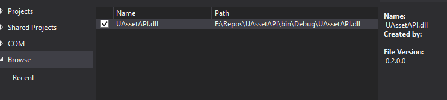
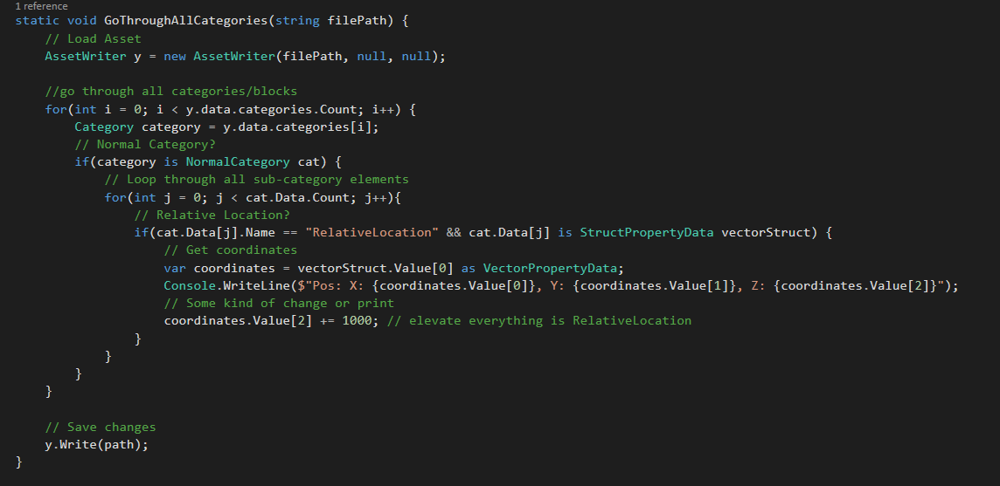
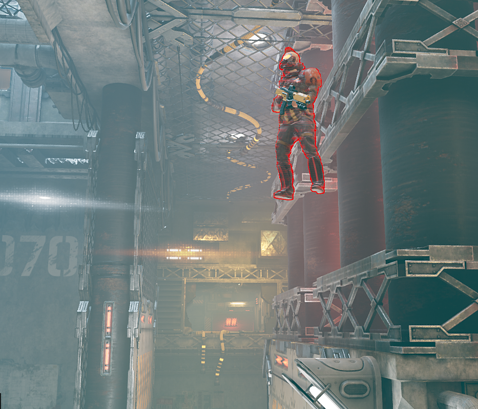

# Using UAssetAPI 

**This is not a coding tutorial! skip this if you have low to zero experience with C# programming** 
_Need help with coding? ask Tipssi._ 

## Clone and build DLL
- Clone [UAssetAPI](https://github.com/atenfyr/UAssetAPI) repo.
- Open project in Visual Studio and build DLL.
- (Don't forget to set Output Type to Class Library in Project Settings)

## New Project
Create a new project and add reference to the DLL.

## Code Snippet(Example)
This code loops through all Categories and their content, looks for RelativeLocation, gets coordinates, prints them and makes some changes(adds 1000 to Z coordinates), and saves changes when done. 

## Results:

After simple packing: 
Every object which contained a valid RelativeLocation got elevated by 1000 units on the Z axis(height).

