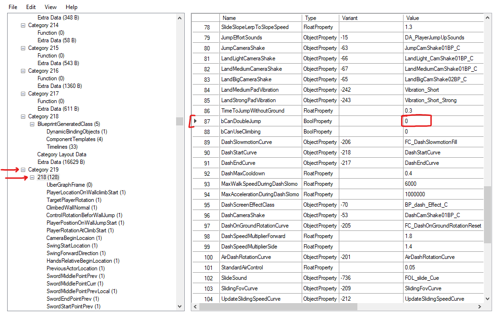
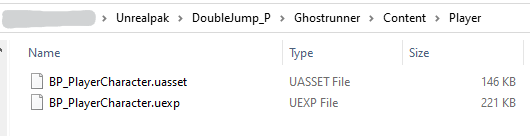
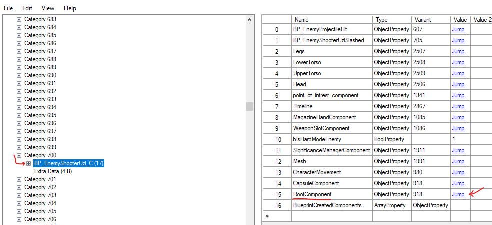
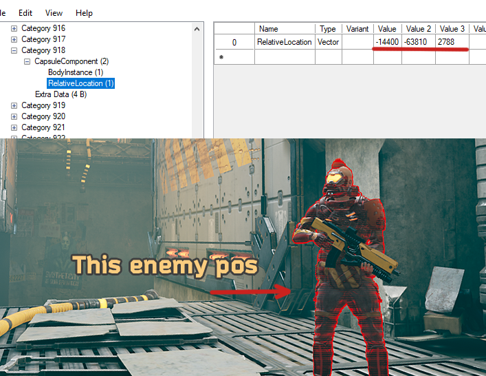

# Using UAssetGUI

We used to have a way different and complicated technique but thanks to recent GR support in UAssetGUI - we can edit almost any GR `UAsset` and `UMap` files **directly**!
</br>
If you would like to skip to UMap editing, check: [Umap Editing](#umap-editing-using-uassetgui) section below.

For this example, we will enable the hidden **double-jump**, yes!

UAssetGUI download: [UAssetGUI](https://github.com/atenfyr/UAssetGUI/releases) 


## Launch UAssetGUI
[Export Type: `Raw`]

Assuming you already exported and located the `.uasset`/`.umap` you want to modify, for this example that would be:
```
\Game\Player\BP_PlayerCharacter.uasset
```

Open it in UAssetGUI.

## Changing Values
Feel free to explore its content, just make sure you change values properly according to their object type.

For this example:
- Expand Category Data
- Scroll down and expand Category 219
- Expand sub-category 218 and select it.
- You will see all the parameters and their values on the right side.
- Scroll down to line 87, `bCanDoubleJump`.
- Change `0` to `1` in the value.



## Mod Pack
**Before you save any changes!**, create the mod pack so you would be able to save changes directly into the modpack and not overwrite the source by accident.

Mod pack: `DoubleJump_P\Ghostrunner\Content\Player\`

Once the mod pack is created, File > Save As, and save the uasset with the same name into your mod pack.




## Pack it!
Since we didn't modify the structure of the file and only its values, you can remove `.uasset` files and leave just the `.uexp`.</br>
- UAssets contain all the references, structure and value declarations.
- UExp contain the direct values.
</br>
And we're done! all you have to do it pack it
</br></br></br>

---

# UMap Editing using UAssetGUI

Similar principle as with UAsset files but with a few minor changes.

Notes:
- Instead of expanding all, look for specific items/objects in Category Information, and based on its number - expand the right Category.
- Each object can be linked between multiple objects meaning an invisible wall is not just a single Category/object.
- When packing, leave `.uexp` files.
- Maps are divided into sub-levels, to determine which sub you need to open, you can use UUU(Universal Unreal engine Unlocker, and the command `stat levels` to display the current sublevel).
- For a first attempt/mod, try moving a static mesh, invisible wall or even an enemy.

## Moving Enemies (Example)
On Awakening/LookInside, enemies of both Classic and HC are stored in </br>
`Levels\Tutorial\Sub_Levels\L_Tutorial_Designer.umap`

Going through `Category Information`, locate the enemy type. They have the same naming pattern, for uzi enemy that's `BP_EnemyShooterUzi_C`.

Expand Category Data, and find the right category, lets say 700, find and expand it, a sub-category will be named as `BP_EnemyShooterUzi_C` inside it and we're looking for the `RootComponent` that contains the location and angle, which is 918 - click Jump.



Expand `CapsuleComponent`, it contains a RelativeLocation which in this case is absolute, makes it easier to change. and sometimes even RelativeRotation if it's different than default.

**About RelativeLocation:** Most of the enemies will have a relative location to their CP or parent object which you can find inside `CapsuleComponent` object labled as `AttachParent` - you can either enter a new RelativePosition that is relative to the previous one or set parent to absolute 0,0,0 and set enemies using absolute/normal positions. 



## Pack it!
Similar to UAsset; before saving changes, create a mod folder with corresponding folders and SaveAs into that mod folder with the same name as the original UMap, remove `.UMap` (leave .uexp) and pack as usually.

## Results


