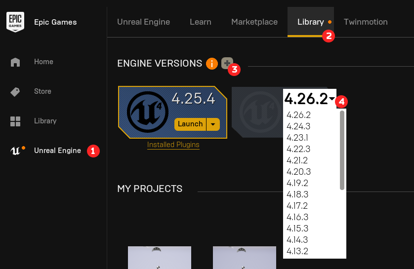

# UE4 Project Setup
## Downloading 4.25 Version
Launch Epic Launcher and navigate to Unreal Engine tab.

- Choose Library.
- Click on the plus icon to install a new Engine version.
- Choose `4.25.X` version from the dropdown and install. 
Since I already have it install, I won't see that option.

## New Project
Launch the 4.25.X engine, and create a new empty project:
- Select `Games` as the New Project Category and click Next.
- Select the `Blank` Template and click Next.
- Project settings leave as default:
- - Blueprint.
- - Desktop/Console.
- - **No Starter Content**.
- - Maximum Quality.
- - Raytracing Disabled.
- Choose the folder and project name and click `Create Project`.

## Project Settings
By default every UE project will build/generate its output into a single PAK file which we don't need because we need individual uasset files, so to do so:
- Edit -> Project Settings -> Packaging
- Uncheck `Use Pak File`.

## Modding Process with UE4
The project that we've created is ready for modding which we will discuss in further guides, but essentially we would create folders to match the game's folder hierarchy and place textures/models in them, and this way the engine will use our PAK file(s) to override the game's default files.